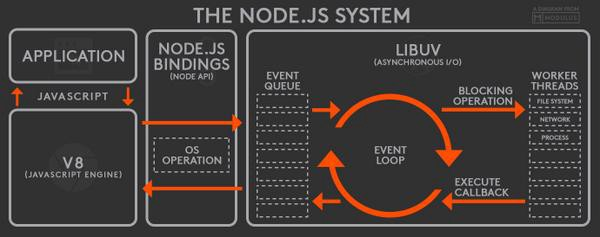

# NodeJS Event Loop  

使用node.js已经有一段时间了，平时虽然对NODE.JS EVENT LOOP有一定的了解，但没有系统性的总结过。  今天我们简单聊一聊。  
## NodeJS Syetem
讲EVENT LOOP之前，我们先聊一聊Node系统结构，如下图：  

   

### V8 

V8引擎官方给出的简介是

`V8 is Google’s open source high-performance JavaScript and WebAssembly engine, written in C++. It is used in Chrome and in Node.js, among others.`

V8 主要是用来提供javascript运行环境，并且使其能够调用C++代码上下文。

`V8 enables any C++ application to expose its own objects and functions to JavaScript code. It’s up to you to decide on the objects and functions you would like to expose to JavaScript.`

C++与JS的不可以直接调用，一般是需要在编译后进行调用。  
具体的底层原理本文不会过多讲解，大家可以参考源码 https://github.com/nodejs/node/blob/master/src/node_main.cc	

### NODE.JS BINDINGS

nodejs bindings会帮我们bind一些用C++写好的插件、模块，如发请求、读文件之类的功能。让V8可以调用这些模块。 源码可以参考 https://github.com/nodejs/node/blob/master/src/node.cc 

### LIBUV

LIBUV提供了多种异步I/O库，并负责分配线程给不同的I/O。NodeJS运行在单线程上，同一时间只会发生一个事件(Event)，在执行层面并不能并行执行代码，但并不意味着Node.js无法操纵线程，LIBUV会通过Event Loop分配线程给不同的I/O。如下图:


## EVENT LOOP

我们试着从这样一个顺序去理解nodeJS如何处理event

1. 我们向Node.js Web Server 发送了一个请求
2. Node.js Web Server在内部维护一个线程池，这个线程池用于处理单线程中收到的request。(Node.js是运行在单线程上的)
3.  Node.js Web Server收到请求并把他们放入事件队列中(Event Queue), 遵照 FIFO的顺序
4. Event Loop 所有在Event Queue中的events
5. 如果Event Queue为空，Event Loop会一直等待有新的事件被添加到Event Queue
6. 如果Event Queue**不为空**，Event Loop会选择其中一个开始执行
   1. 开始处理该eventA
   2. 如果该eventA没有任何阻塞操作，则处理并返回
   3. 如果该eventA有一些阻塞操作，比如setTimeout文件存取、数据库交互、网络请求等，这时候会去检查线程池是否有空闲的线程可用
   4. 选取可用线程A并分配给eventA
   5. 线程A负责处理EventA，执行阻塞操作，将callback传递给callback队列
   6. 回调队列保存是异步操作在后台完成时的回调函数的队列。NodeJS负责将callback func添加到callback queue, **Event Loop确定在每次迭代时接下来将执行的回调函数**。
   7. Event Loop持续运行并检查Event Queue中是否有要执行的Event。如果没有，那么它会检查Callback Queue，如果Callback Queue中有callback func要执行，那么它会将callback Func从Callback Queue pop到Events Queue以供执行。
7. 执行结束返回response

这样大家应该会对node.js中事件处理有一个比较笼统的认识。那么event loop针对不同类型的阻塞event如何确定优先级呢？


Event loop 可以理解为一个无限循环的分阶段去check callback queue，每个阶段都可以看做是一个FIFO的callback queue

1. timers:执行计时器函数，由于计时器方法可以指定时间，只有到时间后才会执行，没到时间会跳过不执行
2. pending callback: 执行上一轮的pending callback. 有些callback执行时间过长，会在这一步检查之前阶段pending状态的callback
3. Idle, prepare: 仅供LIBUV内部使用
4. poll: 轮询等待I/O处理完毕的返回值，不会无限等待，event loop针对不同的平台提供了最大轮训时间，大量的I/O操作可能会让event loop运行缓慢
5. check: 执行setImmediate中定义的回调
6. Close: 执行close的相关事件

## MACROTASK & MICROTASK

宏任务(macrotask)

> 1. script (可以理解为外层同步代码)
> 2. setTimeout/setInterval
> 3. UI rendering/UI事件
> 4. postMessage，MessageChannel
> 5. setImmediate，I/O（Node.js）

微任务(microtask)

> 1. process.nextTick
> 2. Promise
> 3. MutaionObserver


在执行顺序上，

1. 同步代码script肯定会最先执行, 宏任务执行完毕
2. 检查所有微任务队列，执行微任务
   1. Process.nextTick
   2. Promise
3. 微任务执行完毕，开始执行下一轮宏任务

所有的异步方法都会在执行完第一轮微任务后的第二次event loop中添加到宏任务队列中


## TEST

```javascript
setTimeout(() => {
  console.log(1)
  setImmediate(() => {
    console.log(3)
  })
})
setImmediate(() => {
  console.log(4)
  setImmediate(() => {
    console.log(5)
  })
})
new Promise((resolve) => {
  console.log(6)
  resolve()
}).then(() => {
  console.log(7)
})
process.nextTick(() => {
  console.log(8)
  process.nextTick(() => {
    console.log(9)
    process.nextTick(() => {
      console.log(10)
    })
  })
})
```

执行试试吧，看看是否和大家想的一样。
